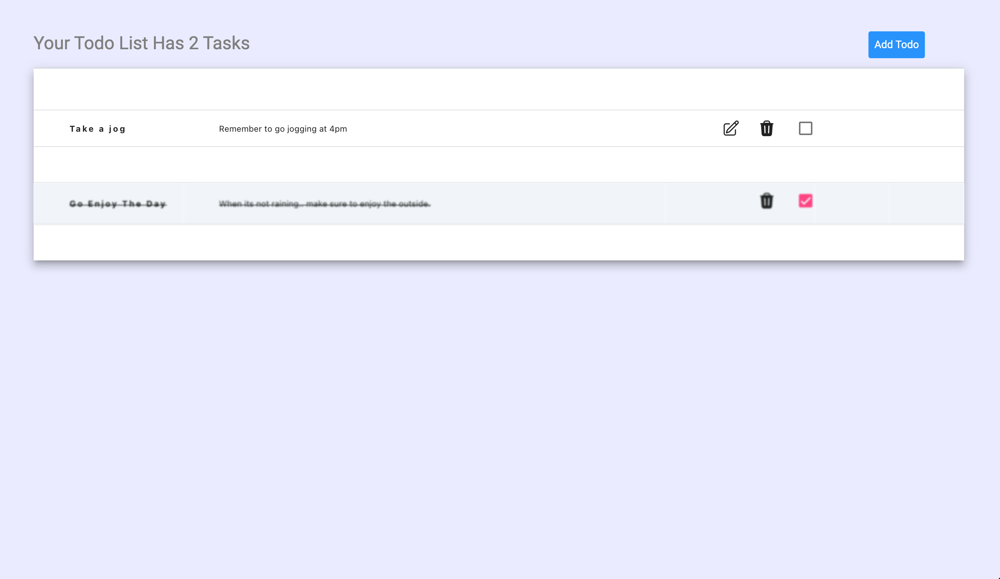

# TodoApp (MEAN Stack Version)

A simple todo app made using mongo, express, angular 15, and nodejs.

 

## Description 

I was tasked with creating a simple app to demonstrate the knowledge base of a fullstack app. While this app serves its purpose as a demo, it lacks security and other necessary protocols that would be required for a live product. The app has a few basic features, such as adding a todo task and marking it as completed. The active tasks always appear at the top of the list, while completed tasks are sent to the bottom. The app's frontend is built using Angular and styled using Material for a clean and modern look. The backend is built with Express and uses a MongoDB instance for data storage. To facilitate deployment, the app can be containerized using Docker.

## Requirements:

To run the project as intended, you will need to have Docker installed. If you prefer to run the client and server outside of a Docker container, you will need to install Node.js and the npm package manager. Additionally, you will need to have a local installation of MongoDB.

## Deployment


### To deploy the app via docker :

1) Git clone the repo :

    ```mkdir TodoApp```

    ```git -C ./TodoApp clone git@github.com:kod3000/TodoApp---MEAN.git```
  

2) Change into the directory


    ```cd TodoApp```
  
3) Run Docker Compose :


    ```docker compose -f docker-compose.yml up```
  
  
### To deploy the app via locally :

1) Git clone the repo :

    ```mkdir TodoApp```

    ```git -C ./TodoApp clone git@github.com:kod3000/TodoApp---MEAN.git```

2) Change into server directory
 
    ```cd TodoApp/Server```

3) Perform npm install and  Start up the server :

 
    ```(Note : make sure to set the uri for the mongodb instance you are using)```
  
    ```npm i```
  
    ```npm start```
  
4) Next change into the client directory


    ```cd TodoApp/Client```


5) Perform npm install and strart up the client :

    ```(Note: Inside the envirnonment forlder set your uri to localhost)```
  
    ```npm i```
  
    ```ng serve```


## Development Notes

I'll eventually add another layer of complexity to this so that each task/todo has sub tasks. Also check out 
my other repos where I demo other stacks using the same TodoApp concept.

-----

### Tip


If this helped you in anyway, throw me some bitcoin so I can get a monster.


 34zin8qyLHUcaN1E9veNoorPujaRVnr6ZZ

